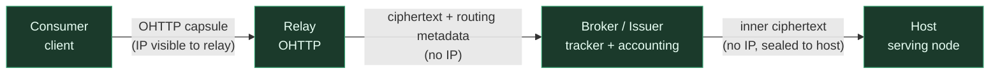
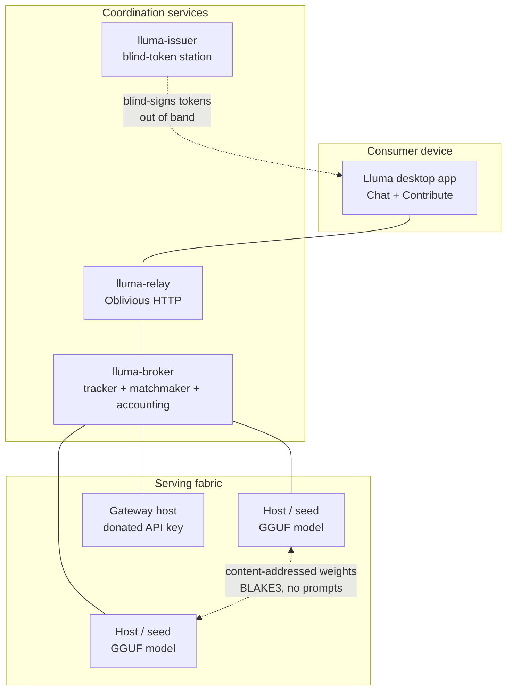
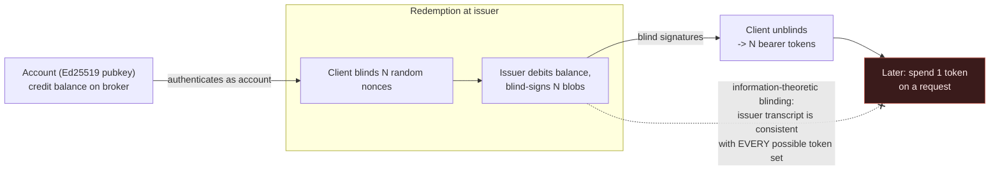

# Lluma: Anonymous, Contribution-Based Peer-to-Peer LLM Inference

**A Technical Whitepaper**

*A Bodegga project — v0.1 draft, 2026-07-15*

---

## Abstract

Lluma is a system for **anonymous large-language-model inference**: a user obtains useful LLM output without any single participant being able to link *who they are* to *what they asked*, while the compute is supplied by a contribution-based, torrent-style fabric of volunteer hosts and donated commercial API keys. The design splits three concerns — network identity, request routing, and prompt content — across three mutually distrusting parties (a relay, a broker, and a serving host), and binds them together with well-reviewed, IETF-standardized cryptography: RFC 9474 RSA blind signatures for unlinkable credit tokens, RFC 9458 Oblivious HTTP for identity-blind transport, and RFC 9180 HPKE for end-to-end prompt confidentiality. This paper describes the threat model, architecture, request lifecycle, and cryptographic constructions, and — because a security document that hides its weaknesses is worthless — enumerates the residual risks and the operational conditions under which the guarantee holds.

**A note on honesty up front.** For the volunteer "Open tier" described here, the serving host *does* see your prompt in plaintext. Lluma's guarantee is that the host cannot link that prompt to your identity or IP, and that your requests are spread across many hosts so none sees your history. It is **not** a claim that the prompt is never read. Content-blindness against the serving operator requires the Confidential (TEE) tier, which is designed but not yet built. We say this plainly here and everywhere.

---

## 1. System model and goals

Lluma delivers anonymous inference through a point-and-click desktop application (a Rust core with a Tauri UI). The application has two faces: a **Contribute** side that auto-detects your hardware and turns hosting a model into a one-click action, and a **Chat** side that sends anonymous requests into the network.

### 1.1 The core privacy invariant

> **No single participant ever holds both "who you are" and "what you asked."**

Everything in the architecture is a mechanism for enforcing that one sentence. Identity (your IP, your account) and content (your prompt) are never present together in any single party's view.

### 1.2 Success criteria

- A request completes end-to-end with **no single party holding both the originator's IP and the prompt plaintext**.
- Requests from the same user are **unlinkable** to each other and to the user's identity (fresh ephemeral key per request; blind-token entitlement).
- The contribution economy makes long-term leeching impossible and makes Sybil attacks cost real resources.

### 1.3 Implementation status (read this before evaluating claims)

This is a **design whitepaper**. It describes the target architecture. Concretely:

| Component | Status |
|---|---|
| Desktop app, hardware detection, model recommendation, local GGUF inference (llama.cpp) | **Implemented (Phase 0), verified against a real model** |
| `lluma-crypto` trust foundation (blind tokens, OHTTP/HPKE, accounts, backup) | **Designed (ADR-0001), in active implementation (Phase 1)** |
| Relay, broker, issuer, host, client services; end-to-end anonymous request | **Designed, not yet built (Phase 1)** |
| Confidential/TEE tier (operator-blind inference) | **Designed, deferred (Phase 4)** |

The anonymity network does not exist yet. Nothing below should be read as "deployed."

---

## 2. Threat model and trust assumptions

### 2.1 What each party sees



| Party | May see | Must never see |
|---|---|---|
| **Relay** | Originator IP, opaque ciphertext | Prompt plaintext; which host serves; account identity |
| **Broker / Issuer** (one operator in MVP) | Ciphertext, routing metadata (model-id, tier, net-coords), account pubkeys + credit ledger (contribution side), *blinded* token requests | Originator IP; prompt plaintext; the link between an account and a spent token |
| **Host** | Prompt plaintext (Open tier), a valid spend token | Originator IP; account identity; the originator's other requests |
| **Consumer** | Everything of its own | — |

### 2.2 Adversary model

Parties are **honest-but-curious individually and may collude pairwise**, with one critical exception spelled out below. The **issuer is trusted for credit integrity** (it could inflate credit balances) but is **not trusted for anonymity** — blindness must hold even against a malicious issuer colluding with the broker and hosts.

**The load-bearing operational assumption (see L1, §9).** The invariant is *architecturally void* if the relay (which sees IP) and the broker (which sees routing metadata) are operated by the same party that logs. Cryptography cannot fix operational co-location. In the single-operator MVP, the relay must run on a separate host, with no shared logs and a documented no-log policy; genuinely independent, community-run relays are a Phase 3 goal.

---

## 3. Architecture and roles

Lluma borrows the BitTorrent vocabulary, but with a precise and important restriction: **Lluma torrents the model *weights*; it runs each inference whole-model on a single host.** Cross-WAN sharding of a single model's layers across peers is explicitly out of scope — WAN latency makes token-by-token cross-peer inference too slow and fragile.



- **Seed** — a host that holds a model's weights and both serves inference and seeds the weight files to others.
- **Peer** — a node fetching weights (content-addressed, verified on arrival) and/or a lightweight consumer.
- **Tracker (the Broker)** — announces which hosts serve which models, tracks health/latency/reputation, and matchmakes requests to hosts. Centralized in the MVP; decentralized (DHT + gossip) in Phase 3.
- **Relay** — an Oblivious HTTP relay that hides the originator's IP from the broker and hosts.
- **Issuer** — a blind-token station that converts credits into unlinkable entitlement tokens.
- **Latency beacon** — Vivaldi-style synthetic network coordinates computed over the relay layer (not raw-IP geolocation), so the broker can pick a nearby fast host without anyone learning real IPs.

The weight-distribution path (content-addressed, BLAKE3-verified) is **separate from the inference path and never carries prompts**.

---

## 4. Request lifecycle

A single anonymous request is **nested encryption**: the prompt is sealed end-to-end to the chosen host *inside* an Oblivious HTTP capsule addressed to the broker. The relay strips the IP; the broker routes on metadata it can read but cannot open the prompt; only the host decrypts it.

```mermaid
sequenceDiagram
    autonumber
    participant Cl as Consumer
    participant Is as Issuer
    participant Re as Relay
    participant Br as Broker
    participant Ho as Host

    Note over Cl,Is: Out of band, earlier
    Cl->>Is: redeem N credits, send N blinded token requests
    Is-->>Cl: N blind signatures (issuer sees blinded blobs only)
    Note over Cl: unblind -> N one-time bearer tokens

    Note over Cl,Ho: Per request
    Cl->>Cl: seal(prompt + session pubkey) to host key (HPKE)
    Cl->>Cl: wrap in OHTTP capsule to broker; attach 1 token
    Cl->>Re: OHTTP capsule (Relay sees IP + ciphertext)
    Re->>Br: forward ciphertext + routing metadata (no IP)
    Br->>Br: verify token (public key), match host by latency/load/tier
    Br->>Ho: inner ciphertext (no IP, sealed to host)
    Ho->>Ho: decrypt, run inference
    Ho-->>Br: response chunk(s) sealed to session key
    Br-->>Re: OHTTP response
    Re-->>Cl: response (E2E-decryptable only by consumer)
    Ho->>Br: signed usage receipt (credits the host, not the consumer)
```

Resilience is built into the path: a host that drops its heartbeat mid-request is detected and the request is transparently retried against the next-best host; a corrupt weight chunk (BLAKE3 mismatch) is re-fetched from another seed and never loaded; an unreachable relay triggers failover to an alternate from the client's bootstrap list.

---

## 5. Cryptographic constructions

All primitives are IETF-standardized (or Standards-Track drafts) with maintained, reviewed Rust implementations. The full rationale, alternatives considered, and parameters are in ADR-0001; this section summarizes.

### 5.1 Blind entitlement tokens — RFC 9474 RSA blind signatures

A consumer proves "I hold credits" without revealing *who*, such that **token issuance cannot be linked to redemption**. Lluma uses **RSABSSA-SHA384-PSS-Randomized** (RFC 9474, the primitive behind Privacy Pass token type 2 and Apple Private Access Tokens), with RSA-2048 issuer keys rotated on long (≥30-day) epochs and a single token denomination.

Two properties make this the right choice:

- **Perfect (information-theoretic) blinding.** The blinded message the issuer signs is uniformly random and independent of the final token. Even an unbounded issuer, colluding with the broker and every host, cannot link a redeemed token to the account that bought it.
- **Public verifiability.** Any party holding only the issuer's *public* key can verify a token offline. The issuer is issuance-only; it need not be online for redemption, and in Phase 3 any host or federated broker can verify without a shared secret. Double-spend is prevented by a per-epoch spent-set keyed by `BLAKE3(token)`.

VOPRF/Privacy-Pass-type-1 tokens were considered and rejected: they are only *privately* verifiable, hard-coupling verification to the secret-holding issuer and blocking decentralization. Blind BLS was rejected for having no IETF-standardized blind variant (the "no novel crypto" rule).

### 5.2 Oblivious transport — RFC 9458 OHTTP + RFC 9180 HPKE

The relay is an OHTTP Oblivious Relay; the broker is the OHTTP Oblivious Gateway. The consumer's request is HPKE-sealed to the broker's published key config, so the relay forwards an opaque capsule and never learns the prompt, while the broker decapsulates the OHTTP layer and still sees only the *inner* ciphertext plus the routing metadata it legitimately needs.

- **Inner end-to-end layer (consumer ↔ host):** RFC 9180 HPKE, ciphersuite **DHKEM(X25519, HKDF-SHA256) + HKDF-SHA256 + ChaCha20-Poly1305**. ChaCha20-Poly1305 is constant-time on heterogeneous volunteer hardware without assuming AES-NI. Algorithm IDs in the key config preserve agility; a post-quantum X-Wing (ML-KEM-768 + X25519) hybrid is the documented upgrade path for the "harvest-now-decrypt-later" risk to prompts.
- **AAD discipline:** routing metadata (model-id, tier, net-coords) is visible to the broker but bound as the *additional authenticated data* of the inner seal, so the broker cannot silently attach different routing metadata to a prompt.
- **Streaming:** RFC 9458 is single-shot. The chunk-sealing API is designed against `draft-ietf-ohai-chunked-ohttp`, but the MVP ships a single terminal chunk while the ecosystem's write-side stabilizes. Regardless, a dropped or truncated final chunk **must fail closed** — this was a real CVE class (CVE-2026-48480) and is a mandatory test.

### 5.3 Ephemeral session keys

Each request carries a **fresh, per-request X25519 response keypair**, generated in client memory, wrapped in zeroize-on-drop types, never written to disk or logs, and never derived from the account key. HPKE already generates a fresh sender ephemeral per seal, so the request direction is fresh for free; the per-request response key removes even within-session linkage. Token, session key, and OHTTP encapsulation share no derivation relationship — each layer's unlinkability is independent.

### 5.4 Account identity and signed receipts

An **account is a locally generated, long-lived Ed25519 keypair** — no PII, nothing server-side at creation. Its human-visible handle is a `BLAKE3` fingerprint of the public key.

The account key lives on **one side only**:

- **Contribution side (identified):** a host signs usage receipts with its account key; the broker keys the credit ledger and reputation to that pubkey. A host was never anonymous to the broker, so this leaks nothing new.
- **Consumption side (anonymous):** the account key is **never presented**. The consumer is an anonymous bearer of blind tokens and an ephemeral session key.

A usage receipt is a domain-separated Ed25519 signature over a canonical body containing the **host's** account, the model-id, tier, priced units, the spent token's `BLAKE3` id, the key epoch, and a *deliberately coarse (hourly)* timestamp. It contains no session key, no ciphertext hash, no fine timestamp — nothing that narrows which consumer it was.

### 5.5 Key backup — self-custodial only

Because credits have real value and the ledger lives broker-side keyed to the pubkey, **losing your device must not lose your account** — only the access key needs backup. The account key is derived deterministically from a **BIP-39 12-word seed phrase** (`mnemonic → BLAKE3 derive_key → Ed25519`). At rest, the seed entropy is encrypted under a user passphrase with **Argon2id** (64 MiB, t=3) and **XChaCha20-Poly1305**. A wrong passphrase fails closed with a typed error, never a garbage key.

**Recovery is self-custodial or zero-knowledge only. Email/phone/PII-based recovery is forbidden** — it would re-key the anonymous economy to a real-world identity, defeating the system's entire purpose. (An optional encrypted cloud-escrow blob, where the server holds ciphertext it cannot open, is possible later polish, not part of the MVP.)

---

## 6. The unlinkability bridge

The one place the identified contribution ledger touches anonymous consumption is **redemption**, and it is precisely there that the link is cryptographically severed.



The issuer's complete view of a redemption is `(account pubkey, N blinded blobs, N blind signatures)`. Because RSA blinding is information-theoretically hiding, that transcript is **equally consistent with every possible set of N unblinded tokens**. When a token is later spent, no party — not even the issuer colluding with the broker and hosts — can trace it back to the redeeming account. The residual linkage is only statistical (timing and counts), addressed by batched pre-fetch, client-side spend buffering, and coarse receipt timestamps (leaks L2/L4).

Crucially, this is enforced by the **shape of the API**, not merely by convention: the verification functions accept only an issuer public key and a token, with no parameter through which an account could arrive; the only account pubkey adjacent to a spent token anywhere is the *host's own*, which is public by design. No function in the trust-foundation crate can even express "consumer account + spendable token" in one place.

---

## 7. Contribution economy and Sybil resistance

You must contribute resources before you sustainably consume, and the contribution is tiered to whatever your device can give: capable machines **host a model** (the celebrated default), weak-but-always-on machines **seed weights and run relays**, and machines with no spare compute can **donate a commercial API key** (the node becomes a gateway that translates network requests to the upstream provider, spending donated quota; keys are encrypted at rest and never leave the machine).

Accounting is anonymous by the same mechanism as spending: contribution produces signed receipts, which are aggregated into a credit balance and spent by presenting blind tokens — so "who earned" and "who spent" cannot be correlated. Credits are non-transferable and redeemable only for the holder's own inference; there is no token trading and no fiat, keeping the system out of regulatory scope.

**Sybil resistance falls out of the economy.** Creating an account is free (just generate a keypair), so a fresh account is worth almost nothing — it receives only a small, community-sponsored trial grant. A *credited* account requires burning real hosted, seeded, or donated compute. Identity is cheap; useful identity is expensive. (The anti-abuse design of the trial grant itself — proof-of-work, vouchers, or a capped pool — is an open broker-side decision, noted in §10.)

---

## 8. Trust tiers

Running a model on a plaintext prompt means some silicon holds that prompt in the clear — unless a confidential-computing technique intervenes. Lluma offers two tiers, chosen per request by the requester:

- **Open tier** — any consumer GPU. The host sees the prompt but cannot link it to the originator. Hardened by signed, open-source, no-log node software and (Phase 3) random canary audits that detect a node which logs or leaks. This is *verifiable good behavior*, not cryptographic blindness.
- **Confidential (ZK) tier** — TEE-attested hosts only (NVIDIA confidential GPU, Intel TDX, AMD SEV-SNP). The prompt is plaintext only inside a hardware enclave the operator cannot inspect, with attestation proving the enclave runs approved, non-logging code. In Lluma, "zero-knowledge inference" means exactly this — TEE-attested, operator-blind — **not** "never decrypted anywhere" (that would be FHE, which remains orders of magnitude too slow). This tier is designed but deferred to Phase 4.

Requiring the Confidential tier universally would shrink the volunteer pool to confidential-computing hardware and contradict the grassroots home-GPU vision, so the tiers coexist and the requester decides.

---

## 9. Known limitations and residual risks

The following register (from ADR-0001) enumerates where an identity↔content link could leak and how each is mitigated. A design that names its weaknesses is one you can actually evaluate.

| # | Risk | Mitigation |
|---|---|---|
| **L1** | **Relay + broker run by the same operator with logs ⇒ the invariant is void against that operator.** This is operational, not cryptographic. | Operational separation in the MVP (separate host, no shared logs, documented no-log policy); independent community relays in Phase 3. |
| L2 | Issuer key epochs partition the anonymity set; per-user keys would be fatal. | One global key per epoch; long (≥30-day) epochs; keys published in a transparency log. |
| L3 | Response-key reuse would let a host link requests. | Fresh per-request keypair, enforced by API construction. |
| L4 | Timing/count correlation: redeem N tokens then immediately spend N. | Batched pre-fetch at fixed sizes; client-side spend buffering/jitter; coarse (hourly) receipt timestamps. |
| L5 | PII-based account recovery would re-identify the economy. | Forbidden; self-custodial seed phrase + passphrase keystore only. |
| L6 | Variable token denominations would partition the anonymity set. | Single denomination. |
| L7 | Routing metadata (model-id, coordinates) as a fingerprint. | Coarse Vivaldi net-coords; model-id is inherently low-cardinality; revisit in Phase 3. |
| L8 | Prompt bytes leaking into logs or error messages. | No error variant may embed plaintext; enforced by review and test. |

The honest summary: **against a curious host, the Open tier protects your identity but not your prompt content; against a curious relay or broker, it protects your prompt content but the parties must not collude or co-locate.** The strongest guarantee — operator-blind content confidentiality — awaits the Confidential tier.

---

## 10. Roadmap and open questions

- **Phase 0 — Dogfood (done):** desktop app + local llama.cpp/GGUF runner + local chat. Proves the app and runtime.
- **Phase 1 — MVP (in progress):** centralized broker + relay + blind-token issuer + credits ⇒ end-to-end anonymous inference across volunteer hosts and API-key donors. Built foundation-first: `lluma-crypto`, then issuer, transport, broker, and the end-to-end slice.
- **Phase 2 — Torrent layer:** P2P content-addressed weight distribution + model registry + seeding.
- **Phase 3 — Decentralize:** DHT tracker, multiple independent relays, gossip health, network-coordinate beaconing, self-healing, canary audits.
- **Phase 4 — Hardening and reach:** Confidential (TEE) tier + attestation; optional I2P/Tor "paranoid" mode; public OpenAI-compatible gateway; web and mobile clients.

**Open questions** include the exact credit-pricing schedule and ratio-throttle curve, the trial-grant anti-abuse mechanism, attestation-verifier design for the Confidential tier, model-registry governance and abuse review, and content-policy posture per tier.

---

## 11. References

- **RFC 9474** — RSA Blind Signatures. Implementation: `blind-rsa-signatures` (jedisct1).
- **RFC 9497** — (V)OPRF (considered, not selected).
- **RFC 9576 / 9578** — Privacy Pass architecture and issuance (token-type compatibility).
- **RFC 9458** — Oblivious HTTP. Implementation: `ohttp` (Martin Thomson).
- **draft-ietf-ohai-chunked-ohttp** — Chunked Oblivious HTTP (streaming responses).
- **RFC 9180** — Hybrid Public Key Encryption (HPKE). Implementation: `rust-hpke` (rozbb).
- **CVE-2026-48480** — missing final-chunk enforcement in a chunked-OHTTP codec (encoded as a mandatory fail-closed test).
- **BIP-39** — mnemonic seed phrases. Rust crates: `bip39`, `ed25519-dalek` v2, `argon2` (RustCrypto), `chacha20poly1305` (RustCrypto), `blake3`, `zeroize`.
- Lluma design specification (`docs/superpowers/specs/2026-07-14-lluma-design.md`) and ADR-0001 (`docs/architecture/adr-0001-lluma-crypto-primitives.md`).

---

*Lluma is a Bodegga project. This document describes a target architecture with an explicit implementation-status caveat (§1.3) and an explicit statement of residual risk (§9). It makes no claim that the anonymity network is currently deployed.*
